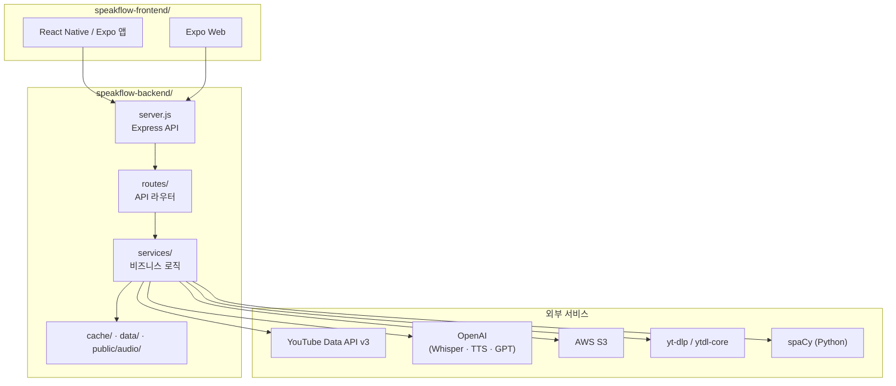

# SpeakFlow 프로젝트 구조 및 설명

> YouTube 영상 기반 영어 스피킹 연습 플랫폼 — 모노레포 (백엔드 + 프론트엔드)

---

## 목차

1. [프로젝트 개요](#1-프로젝트-개요)
2. [전체 아키텍처](#2-전체-아키텍처)
3. [디렉터리 구조](#3-디렉터리-구조)
4. [핵심 모듈 설명](#4-핵심-모듈-설명)
5. [API 엔드포인트](#5-api-엔드포인트)
6. [데이터 흐름](#6-데이터-흐름)
7. [외부 서비스 및 의존성](#7-외부-서비스-및-의존성)
8. [환경 변수](#8-환경-변수)
9. [로컬 개발 및 실행](#9-로컬-개발-및-실행)
10. [배포](#10-배포)
11. [관련 저장소 및 문서](#11-관련-저장소-및-문서)

---

## 1. 프로젝트 개요

**SpeakFlow**는 YouTube 영상을 활용해 영어 스피킹을 연습하는 AI 기반 학습 플랫폼입니다. 사용자는 영상을 검색하고, 자막/음성을 추출한 뒤, 문장 단위로 따라 말하며 학습합니다.

| 항목 | 내용 |
|------|------|
| **저장소 구조** | 모노레포 — `speakflow-backend/` + `speakflow-frontend/` |
| **백엔드** | Express.js REST API (`speakflow-backend/`) |
| **프론트엔드** | React Native + Expo (`speakflow-frontend/`) |
| **Node.js** | ≥ 18.0.0 (Docker/Railway는 20 사용) |
| **패키지 매니저** | npm (루트), yarn 4 (루트 `packageManager` 지정) |

### 주요 기능

- **YouTube 연동** — 영상 검색, 메타데이터 조회, 자막·오디오 추출
- **AI 전사** — OpenAI Whisper로 음성→텍스트 변환 (타이밍 포함)
- **문장 분할** — spaCy / Natural.js로 자연스러운 영어 문장 경계 감지
- **TTS** — OpenAI Text-to-Speech로 문장 음성 생성
- **번역** — OpenAI GPT로 영→한 번역
- **캐싱** — AWS S3 + 로컬 파일 시스템 이중 캐시
- **학습 기록** — JSON 파일 기반 연습 이력 관리

---

## 2. 전체 아키텍처



**요청 처리 흐름 (연습 세션 예시)**

1. 클라이언트가 `/api/youtube/search`로 10분 이하 영상 검색
2. 선택한 영상의 `/api/youtube/transcript-practice/:videoId`로 문장 단위 자막 수신
3. 자막이 없으면 `/api/youtube/audio/:videoId` → `/api/whisper/transcribe`로 Whisper 전사
4. 문장별 `/api/tts/speak`로 TTS 생성, `/api/translate`로 한국어 번역
5. `/api/history/add`로 학습 기록 저장

---

## 3. 디렉터리 구조

```
speakflow/                          # 모노레포 루트
├── README.md                       # 모노레포 개요
├── speakflow-backend/              # 백엔드 API 서버
│   ├── backend/                    # Express 서버 소스
│   │   ├── server.js               # 서버 진입점
│   │   ├── routes/                 # API 라우트
│   │   ├── services/
│   │   ├── scripts/
│   │   ├── test/
│   │   ├── cache/                  # gitignore
│   │   ├── data/history/           # gitignore
│   │   ├── public/audio/           # gitignore
│   │   └── uploads/                # gitignore
│   ├── Dockerfile
│   ├── nixpacks.toml
│   ├── railway.toml
│   ├── package.json
│   ├── README.md
│   ├── OPENAI_SETUP.md
│   └── PROJECT_STRUCTURE.md        # 이 문서
└── speakflow-frontend/             # React Native + Expo 앱
    ├── App.tsx
    ├── src/
    ├── android/
    ├── ios/
    └── package.json
```

### 런타임에 생성되는 디렉터리 (저장소에 포함되지 않음)

| 경로 | 용도 |
|------|------|
| `speakflow-backend/backend/cache/whisper/` | Whisper 전사 JSON 캐시 |
| `speakflow-backend/backend/data/history/` | `user_history.json` 학습 기록 |
| `speakflow-backend/backend/public/audio/` | YouTube에서 추출한 MP3 |
| `speakflow-backend/backend/uploads/` | Whisper API로 업로드된 오디오 |

---

## 4. 핵심 모듈 설명

### 4.1 `backend/server.js`

Express 앱의 진입점입니다.

- `dotenv`로 환경 변수 로드
- CORS, JSON body 파싱 미들웨어
- 6개 라우트 모듈을 `/api/*` prefix로 마운트
- `/api/health` 헬스체크
- `public/` 정적 파일 서빙
- 기본 포트: `process.env.PORT || 3000`

### 4.2 `backend/routes/youtube.js`

YouTube 관련 기능의 중심 라우터입니다. (~1,300줄)

| 기능 | 설명 |
|------|------|
| **검색** | YouTube Data API v3, 10분 이하·관련도 정렬 |
| **영상 상세** | 제목, 썸네일, 조회수, 길이 등 |
| **자막** | `youtube-captions-scraper`, yt-dlp, YouTube API 다단계 폴백 |
| **연습용 자막** | 문장 병합 + spaCy 개선 (`transcript-practice`) |
| **오디오** | S3 캐시 확인 → yt-dlp/ytdl-core 추출 → S3 업로드 |

자막 추출 우선순위 (`transcript-practice`):

1. **yt-dlp** (가장 안정적)
2. **YouTube Data API v3** (SRT 다운로드)
3. **youtube-captions-scraper** (최종 폴백)

### 4.3 `backend/routes/whisper.js`

OpenAI Whisper 기반 음성 전사 및 캐싱 (~1,200줄)

| 기능 | 설명 |
|------|------|
| **전사** | 업로드 파일 또는 URL에서 오디오 → Whisper API |
| **캐시 조회** | 로컬 `cache/whisper/` → S3 순으로 확인 |
| **문장 분할** | spaCy Python 서브프로세스 (실패 시 Natural.js) |
| **YouTube 자막** | Whisper 경로용 향상 자막 엔드포인트 |

spaCy는 `python3 -c "import spacy; nlp = spacy.load('en_core_web_sm')"` 형태로 lazy 로드됩니다.

### 4.4 `backend/routes/tts.js`

OpenAI TTS API (`tts-1` 모델) 래퍼입니다.

- `POST /speak` — 텍스트 → MP3 스트림 반환
- `GET /voices` — alloy, echo, fable, onyx, nova, shimmer 목록

### 4.5 `backend/routes/translate.js`

GPT-3.5-turbo를 사용해 영어 텍스트를 한국어로 번역합니다. 시스템 프롬프트로 번역문만 반환하도록 제한합니다.

### 4.6 `backend/routes/history.js`

파일 기반(`data/history/user_history.json`) 학습 기록 관리입니다.

- 최대 100개 영상 유지
- `videoId`, 제목, 썸네일, 채널, 길이, `transcriptSource` (youtube/whisper) 저장
- S3 오디오 URL 연동 업데이트 지원

### 4.7 `backend/routes/auth.js`

현재 `/test` 헬스체크만 있는 **플레이스홀러**입니다. JWT·bcrypt·mongoose 의존성은 `package.json`에 있으나 아직 라우트에 연결되지 않았습니다.

### 4.8 `backend/services/s3Service.js`

AWS SDK v3 기반 S3 서비스 클래스입니다.

| 메서드 | 용도 |
|--------|------|
| `uploadAudioFile` | `audio/{videoId}.mp3` 업로드 |
| `audioFileExists` / `getAudioFileUrl` | 오디오 존재 확인 및 Public/Signed URL |
| `uploadWhisperCache` / `getWhisperCache` | Whisper JSON 캐시 |
| `whisperCacheExists` | 캐시 존재 여부 |
| `deleteAudioFile` / `deleteWhisperCache` | 캐시 삭제 |
| `setupBucketCORS` | 버킷 CORS 설정 |

### 4.9 `backend/services/youtube-captions.js`

yt-dlp 기반 자막·오디오 추출 전용 모듈입니다.

| 함수 | 설명 |
|------|------|
| `extractCaptionsWithYtDlp` | SRT 자막 추출 및 파싱 |
| `extractAudioWithYtDlp` | MP3 오디오 다운로드 |
| `mergeCaptionsIntoSentences` | 자막 세그먼트 → 문장 병합 |
| `getCaptions` | 통합 자막 추출 진입점 |
| `parseSRTContent` | SRT → `{ text, start, dur }[]` |

---

## 5. API 엔드포인트

### 공통

| Method | Path | 설명 |
|--------|------|------|
| GET | `/api/health` | 서버 상태 확인 |

### YouTube — `/api/youtube`

| Method | Path | 설명 |
|--------|------|------|
| GET | `/search?query=&maxResults=` | 영상 검색 (≤10분 필터) |
| GET | `/video/:videoId` | 영상 메타데이터 |
| GET | `/transcript/:videoId` | 원본 자막 (scraper) |
| GET | `/transcript-practice/:videoId?useSpacy=true` | 연습용 문장 단위 자막 |
| POST | `/transcript-practice` | POST 버전 연습 자막 |
| GET | `/audio/:videoId` | 오디오 URL (S3 또는 로컬) |
| GET | `/debug/test` | 디버그용 |

### Whisper — `/api/whisper`

| Method | Path | 설명 |
|--------|------|------|
| GET | `/cache-exists/:videoId` | 전사 캐시 존재 여부 |
| GET | `/cached/:videoId` | 캐시된 전사 결과 |
| POST | `/transcribe` | 오디오 전사 (multipart 또는 URL) |
| GET | `/youtube-subtitles/:videoId` | YouTube + Whisper 향상 자막 |
| GET | `/debug/environment` | 환경 디버그 |

### TTS — `/api/tts`

| Method | Path | 설명 |
|--------|------|------|
| POST | `/speak` | `{ text, voice, speed }` → MP3 |
| GET | `/voices` | 사용 가능 음성 목록 |

### Translate — `/api/translate`

| Method | Path | 설명 |
|--------|------|------|
| POST | `/` | `{ text, targetLanguage }` → 번역 |

### History — `/api/history`

| Method | Path | 설명 |
|--------|------|------|
| GET | `/` | 전체 기록 (최근순) |
| GET | `/:videoId` | 단일 영상 기록 |
| POST | `/add` | 기록 추가/갱신 |
| POST | `/update-audio/:videoId` | 오디오 URL 갱신 |
| DELETE | `/:videoId` | 단일 삭제 |
| DELETE | `/` | 전체 삭제 |

### Auth — `/api/auth`

| Method | Path | 설명 |
|--------|------|------|
| GET | `/test` | 라우트 동작 확인 (플레이스홀더) |

---

## 6. 데이터 흐름

### 6.1 자막 추출 (Practice Transcript)

```
Client
  → GET /api/youtube/transcript-practice/:videoId
    → [1] youtube-captions.getCaptions (yt-dlp)
         → mergeIntoSentences
         → improveSentencesWithSpacy (optional)
    → [2] YouTube captions.list + captions.download (SRT)
         → parseSRTContent → mergeIntoSentences
    → [3] youtube-captions-scraper getSubtitles
         → mergeIntoSentences
  ← JSON { sentences[], totalDuration, source }
```

### 6.2 오디오 추출 및 캐싱

```
Client
  → GET /api/youtube/audio/:videoId
    → s3Service.audioFileExists?
         YES → getAudioFileUrl → { audioUrl }
    → extractAudioWithYtDlp / ytdl-core
    → s3Service.uploadAudioFile
    → (optional) 로컬 public/audio/ 저장
  ← JSON { audioUrl, format, cached }
```

### 6.3 Whisper 전사 및 캐싱

```
Client
  → POST /api/whisper/transcribe { videoId, audioUrl | file }
    → cache local/S3 hit? → return cached
    → OpenAI Whisper API
    → tokenizeWithSpacy / natural tokenizer
    → save cache/whisper/{videoId}.json
    → s3Service.uploadWhisperCache
  ← JSON { sentences[], source, cached }
```

---

## 7. 외부 서비스 및 의존성

### Node.js (backend/package.json)

| 패키지 | 용도 |
|--------|------|
| `express`, `cors`, `dotenv` | HTTP 서버 |
| `googleapis` | YouTube Data API v3 |
| `@distube/ytdl-core`, `ytdl-core` | YouTube 스트림 |
| `youtube-captions-scraper`, `youtube-transcript` | 자막 스크래핑 |
| `youtube-dl-exec` | yt-dlp Node 래퍼 |
| `openai` | Whisper, GPT, TTS |
| `@aws-sdk/client-s3`, `@aws-sdk/s3-request-presigner` | S3 |
| `natural` | JS 문장 토크나이저 (spaCy 폴백) |
| `multer` | 오디오 업로드 |
| `mongoose`, `jsonwebtoken`, `bcryptjs` | 인증용 (미연결) |

### Python (시스템 / Docker)

| 도구 | 용도 |
|------|------|
| `yt-dlp` | 자막·오디오 추출 |
| `spacy` + `en_core_web_sm` | 영어 문장 경계 감지 |
| `ffmpeg` | 오디오 변환 (Docker) |

### 클라우드 API

| 서비스 | 필수 여부 | 용도 |
|--------|-----------|------|
| YouTube Data API v3 | 권장 | 검색, 메타데이터, 자막 |
| OpenAI API | 권장 | Whisper, TTS, 번역 |
| AWS S3 | 선택 | 오디오·전사 캐시 (없으면 로컬만) |

---

## 8. 환경 변수

`backend/.env`에 설정합니다. (`.env.example` 참고 — gitignore로 저장소에 없을 수 있음)

| 변수 | 설명 | 기본값 |
|------|------|--------|
| `PORT` | 서버 포트 | `3000` |
| `HOST` | 바인드 주소 | `0.0.0.0` |
| `NODE_ENV` | 환경 | `development` |
| `YOUTUBE_API_KEY` | Google YouTube API | — |
| `OPENAI_API_KEY` | OpenAI (Whisper/TTS/GPT) | — |
| `AWS_ACCESS_KEY_ID` | AWS 액세스 키 | — |
| `AWS_SECRET_ACCESS_KEY` | AWS 시크릿 | — |
| `AWS_REGION` | S3 리전 | `us-east-1` |
| `AWS_S3_BUCKET` | S3 버킷 이름 | `speakflow-audio-files` |

서버 시작 시 각 키 설정 여부가 콘솔에 출력됩니다.

---

## 9. 로컬 개발 및 실행

### 사전 요구사항

- Node.js 18+
- Python 3.8+ (`spacy`, `en_core_web_sm`, `yt-dlp`)
- ffmpeg (오디오 처리)
- API 키 (YouTube, OpenAI), AWS (선택)

### 설치 및 실행

```bash
# 루트에서 (backend 의존성 자동 설치)
npm install

# Python 의존성
pip3 install spacy yt-dlp
python3 -m spacy download en_core_web_sm

# 환경 변수
cp backend/.env.example backend/.env
# .env 편집

# 개발 서버 (nodemon, cache/data/public 변경 무시)
npm run dev

# 프로덕션
npm start
```

헬스체크: `http://localhost:5030/api/health` (또는 설정한 `PORT`)

### 유틸리티 스크립트

```bash
cd backend

# AWS S3 연결 테스트
node scripts/tests/test-aws-connection.js

# S3 버킷 정책 설정
node scripts/aws-setup/setup-bucket-policy.js

# 로컬 캐시 → S3 업로드
node scripts/upload-cache-to-s3.js
```

---

## 10. 배포

### Docker

`Dockerfile`은 Node 20-slim + Python + spaCy + yt-dlp + ffmpeg를 포함합니다.

```bash
docker build -t speakflow .
docker run -p 5030:5030 --env-file backend/.env speakflow
```

### Railway

`railway.toml` 설정:

- Builder: Dockerfile
- Start: `npm start`
- Healthcheck: `/api/health`

### Render / Nixpacks

`nixpacks.toml`에서 Node 20, Python, yt-dlp, spaCy 모델을 빌드 단계에 설치합니다.

---

## 11. 관련 저장소 및 문서

| 문서/저장소 | 설명 |
|-------------|------|
| [../README.md](../README.md) | 모노레포 개요 |
| [README.md](./README.md) | API 사용법, API 키 설정, 트러블슈팅 |
| [backend/README.md](./backend/README.md) | 백엔드 빠른 시작, Railway 배포 |
| [backend/scripts/README.md](./backend/scripts/README.md) | AWS/S3 스크립트 설명 |
| [OPENAI_SETUP.md](./OPENAI_SETUP.md) | OpenAI API 키 및 비용 안내 |
| [../speakflow-frontend/](../speakflow-frontend/) | React Native / Expo 클라이언트 (로컬) |

### 프론트엔드와의 관계

프론트엔드는 같은 모노레포의 `speakflow-frontend/` 폴더에 있습니다. React Native + Expo 기반이며, `src/services/youtubeService.ts`의 `API_BASE_URL`이 백엔드 URL을 가리킵니다. 백엔드와 프론트엔드는 각각 독립 Git 저장소(`innoddu/speakflow`, `Innoddu/speakflow-frontend`)로도 관리됩니다.

---

## 부록: 테스트 파일 (`backend/test/`)

수동 검증용 스크립트 모음입니다. CI에 연결되어 있지 않습니다.

| 파일 | 목적 |
|------|------|
| `test-youtube-api.js` | YouTube API 연동 |
| `test-ytdl-captions.js` | ytdl 자막 추출 |
| `test-specific-video.js` | 특정 영상 테스트 |
| `test-direct-download.js` | 직접 다운로드 |
| `test-oauth2.js` | OAuth2 흐름 |
| `test-alternatives.js` | 대체 추출 방법 |
| `test-working-solution.js` | 통합 솔루션 검증 |
| `save-token.js` | OAuth 토큰 저장 |

---

*마지막 업데이트: 2026-06-20*
