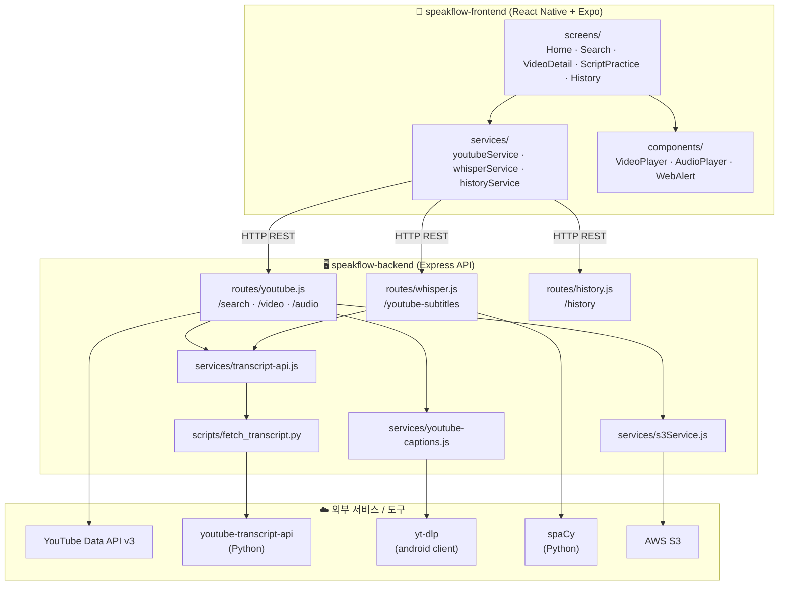
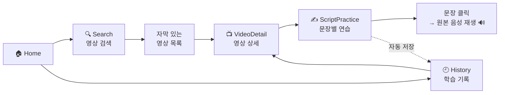
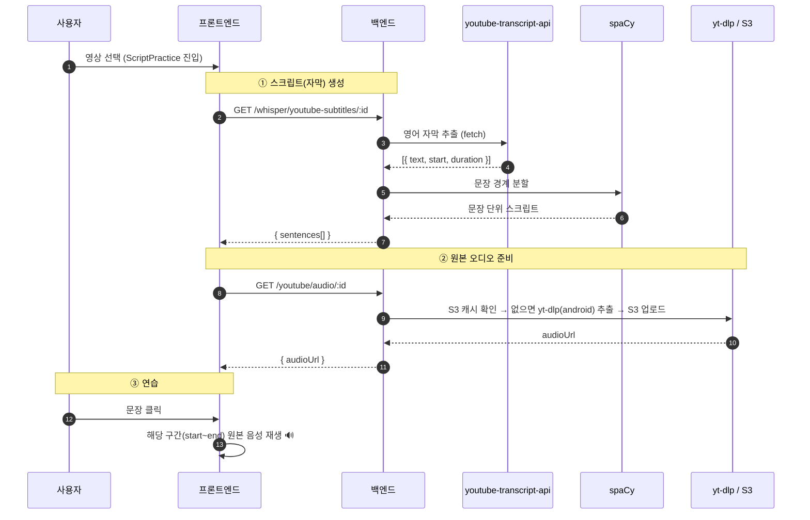
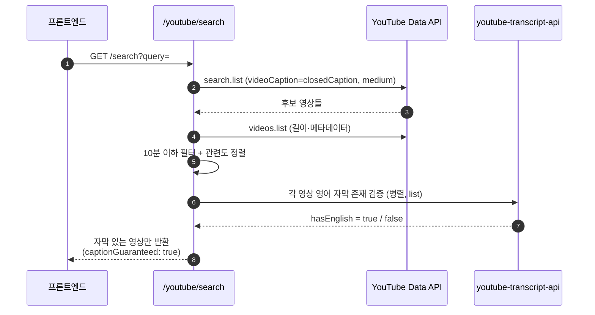
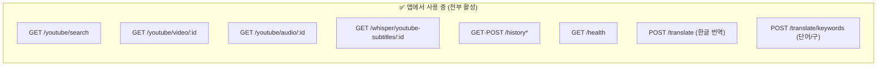

# SpeakFlow 아키텍처 다이어그램

> 현재 코드 기준 전체 흐름과 구조. (captions-only 전략 적용 후)
> Mermaid 다이어그램은 GitHub·VS Code 등에서 렌더링됩니다.

> 작성일: 2026-06-21

---

## 1. 한눈에 보는 전체 구조



---

## 2. 사용자 흐름 (화면 이동)



---

## 3. 핵심 기능: 스크립트 생성 + 연습 (시퀀스)



---

## 4. 검색 필터 — "자막 있는 영상만" (captions-only 핵심)



> 이 2층 필터(검색 파라미터 + 자막 검증) 덕분에 **사용자에게 보이는 모든 영상은 스크립트 생성이 보장**된다.

---

## 5. API 엔드포인트 맵



> `/translate`·`/translate/keywords`는 스크립트 카드의 **왼쪽 스와이프(번역 → 단어 학습)** 에 사용되며 **Google Gemini**로 처리된다. 미사용이던 `tts`·`auth` 라우트는 제거됨.

---

## 6. 디렉터리 구조 (현재)

```
speakflow/
├── docs/                              # 설계·분석·다이어그램 문서
│   ├── README.md
│   ├── architecture-diagram.md        # 이 문서
│   ├── script-generation-analysis.md
│   ├── script-generation-implementation.md
│   └── swipe-translation-implementation.md
│
├── speakflow-backend/
│   └── backend/
│       ├── server.js                  # Express 진입점
│       ├── routes/
│       │   ├── youtube.js             # 검색 · 영상 · 오디오
│       │   ├── whisper.js             # 자막→문장 스크립트 생성
│       │   ├── history.js             # 학습 기록
│       │   └── translate.js           # 번역 · 단어추출 (Gemini)
│       ├── services/
│       │   ├── transcript-api.js      # youtube-transcript-api 래퍼
│       │   ├── youtube-captions.js    # yt-dlp 오디오 추출
│       │   └── s3Service.js           # AWS S3
│       └── scripts/
│           └── fetch_transcript.py    # 영어 자막 추출/검증 (Python)
│
└── speakflow-frontend/
    ├── App.tsx                        # 네비게이션 (Stack)
    └── src/
        ├── screens/                   # Home·Search·VideoDetail·ScriptPractice·History
        ├── services/                  # youtubeService·whisperService·historyService
        ├── components/                # VideoPlayer·AudioPlayer·WebAlert
        └── config/api.ts              # 백엔드 URL 설정
```

---

## 7. 데이터 흐름 요약

| 단계 | 화면/엔드포인트 | 핵심 외부 의존 |
|------|----------------|----------------|
| 영상 검색 | `/youtube/search` | YouTube Data API + youtube-transcript-api(검증) |
| 영상 상세 | `/youtube/video/:id` | YouTube Data API |
| 스크립트 생성 | `/whisper/youtube-subtitles/:id` | youtube-transcript-api + spaCy |
| 오디오 준비 | `/youtube/audio/:id` | yt-dlp(android) + AWS S3 |
| 학습 기록 | `/history*` | 로컬 JSON (`data/history`) |
